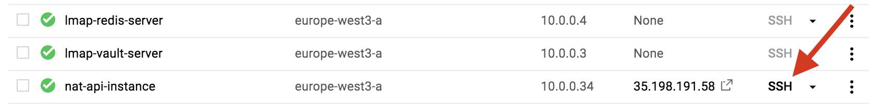

# SSH Access

## Using `gcloud` in the terminal
1. [Install gcloud](https://cloud.google.com/sdk/downloads) on your local machine.
2. Run `gcloud init`. This will guide you through setting up a GCP project (i.e. learning-map) on your local machine.
3. Run `gcloud compute instances list`. This shows the instances running on the project you setup above. Please note that only the machine named **nat-api-instance** allows direct SSH access from your machine. It is through it that you can access the internal network virtual machines.
4. Run `gcloud beta compute ssh nat-api-instance --zone europe-west3-a`. This will log you into the **nat-api-instance** and it is from here that you can access the virtual machines running the LMap app.
5. Run `gcloud compute instances list` again to see the available virtual machines.
6. Run `gcloud beta compute ssh <machine-name> --internal-ip` but this time use one of the other virtual machines listed by the above command.
7. If it is the first time the your account is accessing the server, SSH keys will be generated and a passphrase requested. Just press enter when prompted for the passphrase.

#### Accessing the LMap application
8. Once logged in, the prompt will display your name however, to do anything with the LMap application you need to login as the a user called `ubuntu`.
9. Run `sudo su - ubuntu` to change the account to the `ubuntu` user.
10. Run `cd ~` to go to the home directory of the *ubuntu* user.
11. Run `cd learning_map_api`. This is the folder that contains the LMap API application and where normal Python and Flask commands affecting the application can be run. Note that the virtual environment is activated using `source Env/lmap/bin/activate`

## Using Google Console
1. Log into Google Console
2. Select the appropriate project you want to view in the console i.e. learning-map.
3. Click `Compute Engine` link from the menu.
4. Click the SSH button on the **nat-api-instance** machine and an SSH session will start in a separate tab. The SSH button is pointed to by the red arrow below.
5. When the session is ready follow instructions 5 - 11 above.

**NOTE: Only people that have IAM roles setup on the particular GCP LMap project can gain SSH access to any of the VMs including the nat-api-instance**
